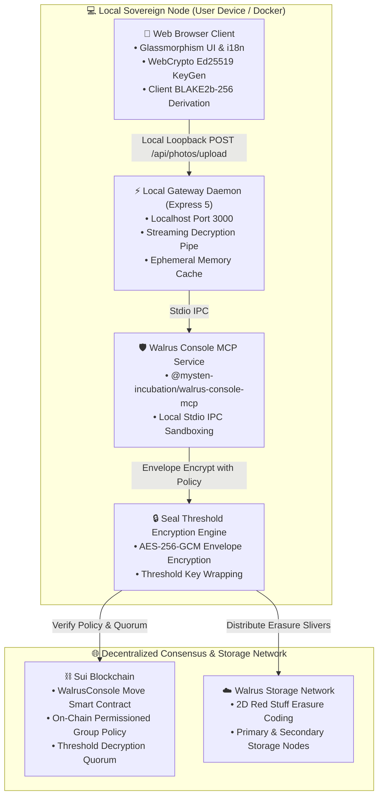

# 🌊 Nodus — Sovereign Cloud & Private Storage

> **A consumer-grade, privacy-first programmable private cloud alternative to Google Drive, Photos, and Apple iCloud, powered by the Walrus Protocol and the Sui blockchain.**

[](https://sui.io)
[](https://walrus.xyz)
[](https://github.com/MystenLabs)
[](https://docker.com)
[](LICENSE)

---

## 📸 Overview

**Nodus** gives users full cryptographic sovereignty over their personal media and documents. Traditional cloud storage providers inspect private files to train commercial machine-learning models, build advertising profiles, or lock accounts arbitrarily. Nodus reclaims user ownership:

- 🔒 **Threshold Envelope Encryption (Seal)**: Media is sealed via AES-256-GCM envelope encryption wrapped against on-chain Sui policies before raw slivers are distributed across the Walrus decentralized network.
- 🌊 **Decentralized Fountain Erasure Coding (Walrus)**: Files are split into 2D Red Stuff erasure-coded slivers distributed across independent storage nodes, cutting redundancy storage costs compared to traditional cloud infrastructure (AWS S3 / Google Cloud).
- ⚡ **Non-Blocking Background Uploads**: Continue browsing your gallery, viewing high-resolution Lightbox media, and editing tags while uploads process in a bottom-docked upload manager.
- 🔑 **Sovereign Cryptographic Identity**: 100% in-browser Ed25519 keypair generation via the standard WebCrypto API, with zero server exposure, backed by Sui on-chain Move access policies.
- 🔍 **Dual Explorer Verification**: 1-click on-chain verification of raw storage slivers on **Walruscan** and threshold access policies on **SuiVision** and **SuiScan**.
- 🌐 **3-Language Localization**: Native internationalization in 🇺🇸 English, 🇪🇸 Español, and 🇧🇷 Português.

---

## 🏛️ System Architecture



---

## ✨ Features

1. **Optimistic Timeline & Background Dock**:
   - Uploaded photos appear immediately in your timeline with live preview, pulsing Sui-blue progress rings, and real-time stage badges (`1. Seal Encryption` ➔ `2. Walrus Blob Store` ➔ `3. Anchored`).
   - Pinned collapsible floating upload dock in the bottom-right corner.

2. **Decrypted Streaming & Provenance Inspector**:
   - Stream original high-resolution photos bit-for-bit decrypted on the fly.
   - Lightbox inspector displaying **Walrus Blob ID**, **Console File ID**, **Seal Encryption Policy**, byte size, and timestamps.
   - Direct external links to inspect storage certification on [Walruscan](https://walruscan.com/testnet), and live on-chain policy objects on [SuiVision](https://suivision.xyz) and [SuiScan](https://suiscan.xyz).

3. **Vault Identity & On-Device WebCrypto**:
   - Switch between Master Custodian and Ephemeral Beta Tester Vaults.
   - 1-click in-browser generation of cryptographic Ed25519 keypairs and derived `0x...` Sui addresses using standard `window.crypto.subtle` (zero server transmission).

4. **Dynamic Tag Filtering & Batch Actions**:
   - Instant filtering chips (`All`, `crypto`, `photo`, `nodus`, etc.) and multi-criteria sorting (Newest, Oldest, Name A-Z, Size).
   - Floating batch selection bar with bulk download and batch deletion.

5. **Irreversible Crypto-Shredding**:
   - Enforces digital right-to-be-forgotten via **Crypto-Shredding** (aligned with NIST SP 800-88 cryptographic sanitization guidelines): deleting an asset revokes access to the decryption policy keys, mathematically rendering remaining distributed ciphertext slivers permanently unrecoverable across all storage nodes.

---

## 🚀 Quickstart

### Prerequisites
- [Docker](https://www.docker.com/) & Docker Compose (or Node.js 20+)
- Walrus Console API credentials

### 1. Clone & Configure
```bash
git clone https://github.com/samuelcampozano/SUIGALLERY.git
cd SUIGALLERY

# Copy environment template
cp .env.example .env
```

Add your Walrus Console credentials in `.env`:
```env
CONSOLE_API_KEY=hbr_your_api_key_here
CONSOLE_SERVICE_PRIVATE_KEY=suiprivkey1_your_private_key_here
CONSOLE_WEB_ACCOUNT_ADDRESS=0x_your_owner_address_here
CONSOLE_API_BASE_URL=https://api.console.walrus.xyz
CONSOLE_MCP_ALLOWED_DIRS=/app
```

### 2. Run with Docker Compose
```bash
docker compose up -d --build
```
Open **[http://localhost:3000](http://localhost:3000)** in your browser.

### 3. Local Development (Without Docker)
```bash
npm install
npm run dev
```

### 4. Run Automated Test Suites
Run the automated test suites verifying backend security defenses, API endpoints, zero-plaintext privacy, on-chain Sui Mainnet policies, and live crypto-shredding:
```bash
# Run all 5 test suites end-to-end
npm test

# Run individual suites
npm run test:security       # Magic bytes validation, path traversal defense, XSS escaping, cache TTL
npm run test:api            # REST endpoints, rate limiting, and HTTP security headers
npm run test:zero-plaintext # Validates zero plaintext disk/memory leaks, enforces ciphertext, 404 on wallet endpoint
npm run test:onchain        # Sui Mainnet GraphQL Move policy and custodian verification
npm run test:shred          # End-to-end live crypto-shredding and bit-for-bit validation
```

---

## 🧪 API Reference

| Method | Endpoint | Description |
| :--- | :--- | :--- |
| `GET` | `/api/status` | Space quota, bucket metadata, and Seal policy |
| `GET` | `/api/photos` | List all photos anchored in the bucket with encryption metadata |
| `POST` | `/api/photos/upload` | Ingest client-encrypted AES-256-GCM ciphertext payload |
| `GET` | `/api/photos/:fileId/stream` | Stream ciphertext blob with decryption headers (`x-nodus-encrypted`) |
| `PATCH` | `/api/photos/:fileId` | Update photo name, caption, and tags |
| `DELETE`| `/api/photos/:fileId` | Delete photo and trigger crypto-shredding |
| `POST` | `/api/photos/batch-delete` | Batch multi-photo deletion |

---

## 🛡️ Security & Zero-Knowledge Architecture

- **Zero Plaintext Server Ingestion (Phase 0 Zero-Knowledge)**: Files are encrypted directly inside the client's browser memory via the standard WebCrypto API (AES-256-GCM) prior to network transmission. Zero bytes of plaintext ever reach the server disk, memory, or Walrus storage network. The backend validates and rejects any raw unencrypted file signatures.
- **Local Sovereign Gateway**: The application operates as a self-hosted sovereign node on the user's device (`localhost:3000` / local container). Unencrypted photos are never routed through cloud intermediaries.
- **Seal Threshold Encryption**: Media is encrypted using AES-256-GCM envelope encryption. Decryption keys are governed by threshold policies anchored to the Sui blockchain, preventing single-point key exposure.
- **No Master Key Custody**: Decentralized storage node operators and protocol developers hold no master keys. Key recovery requires threshold consensus verification against Move smart contracts.
- **On-Device Cryptographic Key Generation**: Ephemeral vault identities and AES keys are generated directly inside the user's browser memory via the standard WebCrypto API, eliminating server-side key custody risks.
- **Edge-First Local Compute**: Search indexing, metadata extraction, and facial clustering run locally on-device (client-side WebAssembly / WebGPU), ensuring sensitive biometric vectors or telemetry are never centralized.

---

## 📄 License
This project is licensed under the MIT License - see the [LICENSE](LICENSE) file for details.
