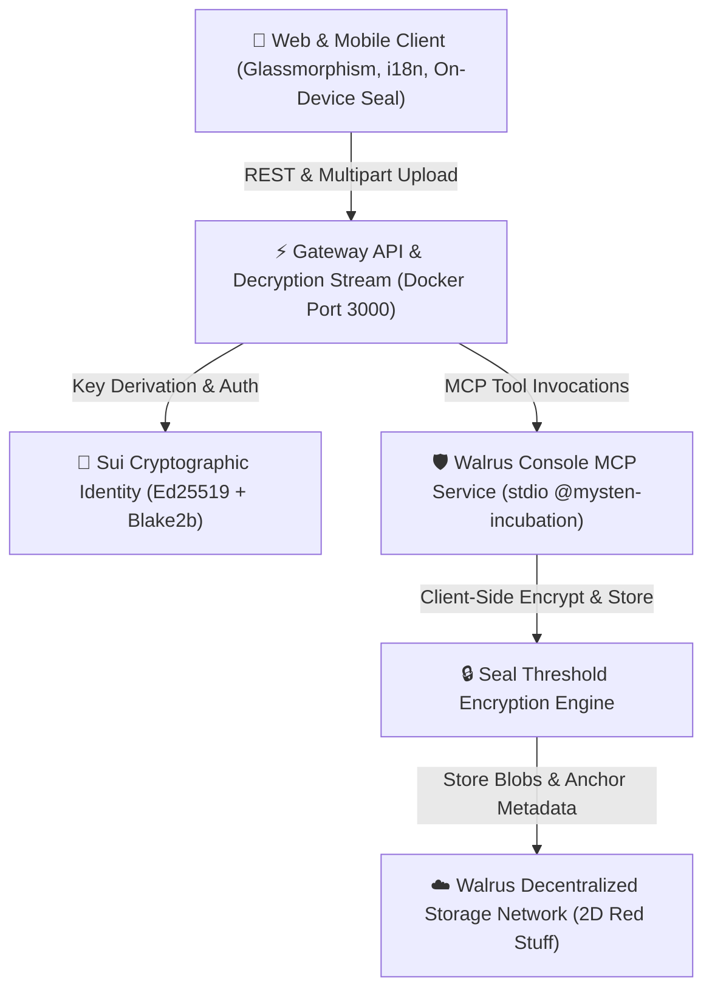

# 🌊 SuiGallery — Sovereign Cloud Photo Vault

> **A consumer-grade, privacy-first alternative to Google Photos and Apple iCloud, powered by the Walrus Protocol and the Sui blockchain.**

[](https://sui.io)
[](https://walrus.xyz)
[](https://github.com/MystenLabs)
[](https://docker.com)
[](LICENSE)

---

## 📸 Overview

**SuiGallery** gives users full cryptographic sovereignty over their photos and memories. Traditional cloud storage providers scan your files to train AI models, calibrate advertising profiles, or lock you out without human appeal. SuiGallery reclaims ownership:

- 🔒 **Zero-Knowledge Privacy (Seal)**: Photos are encrypted on your local device before touching the network using **Seal Threshold Envelope Encryption**. Even storage node operators and protocol developers cannot view your pictures.
- 🌊 **Decentralized Fountain Erasure Coding (Walrus)**: Files are split into 2D Red Stuff erasure-coded slivers distributed across independent storage nodes, cutting costs by up to 85% compared to legacy cloud storage (AWS S3 / Google Cloud).
- ⚡ **Non-Blocking Background Uploads**: Continue browsing your gallery, viewing high-resolution Lightbox media, and editing tags while uploads process seamlessly in a bottom-docked upload manager.
- 🔑 **Sovereign Cryptographic Identity**: Backed by Sui on-chain policies, with 1-click ephemeral beta vault generation and full **zkLogin** architecture.
- 🔍 **Explorer Verification**: 1-click verification of raw storage slivers on **Walruscan** and on-chain threshold policies on **SuiVision**.
- 🌐 **3-Language Localization**: Full native internationalization in 🇺🇸 English, 🇪🇸 Español, and 🇧🇷 Português.

---

## 🏛️ System Architecture



---

## ✨ Features

1. **Optimistic Timeline & Background Dock**:
   - Dropped photos appear immediately in your timeline with live preview, pulsing Sui-blue progress rings, and real-time stage badges (`1. Seal Encryption` ➔ `2. Walrus Blob Store` ➔ `3. Anchored`).
   - Pinned collapsible floating upload dock in the bottom-right corner.

2. **Decrypted Streaming & Provenance Inspector**:
   - Stream original high-resolution photos bit-for-bit decrypted on the fly.
   - Lightbox inspector displaying **Walrus Blob ID**, **Console File ID**, **Seal Encryption Policy**, byte size, and timestamps.
   - Quick external links to inspect storage certification on [Walruscan](https://walruscan.com/testnet), and on-chain access objects on [SuiVision](https://suivision.xyz) and [SuiScan](https://suiscan.xyz).

3. **Vault Identity & Ephemeral Testing**:
   - Switch between Master Custodian and Ephemeral Beta Tester Vaults.
   - 1-click generation of cryptographic Ed25519 keypairs and derived `0x...` Sui addresses.

4. **Dynamic Tag Filtering & Batch Actions**:
   - Instant filtering chips (`All`, `crypto`, `photo`, `suigallery`, etc.) and multi-criteria sorting (Newest, Oldest, Name A-Z, Size).
   - Floating batch selection bar with bulk download and batch deletion.

5. **Compliance & Crypto-Shredding**:
   - Meets GDPR Art. 17 and LGPD Art. 18 right-to-be-forgotten standards through **Crypto-Shredding** (NIST SP 800-88 Rev. 1): deleting a photo revokes the on-chain decryption capability, rendering remaining ciphertext mathematically unrecoverable.

---

## 🚀 Quickstart

### Prerequisites
- [Docker](https://www.docker.com/) & Docker Compose (or Node.js 20+)
- Walrus Console API credentials

### 1. Clone & Configure
```bash
git clone https://github.com/example/suigallery.git
cd suigallery

# Copy environment template
cp .env.example .env
```

Add your Walrus Console credentials in `.env`:
```env
CONSOLE_API_KEY=hbr_your_api_key_here
CONSOLE_SERVICE_PRIVATE_KEY=suiprivkey1_your_private_key_here
CONSOLE_WEB_ACCOUNT_ADDRESS=0x_your_owner_address_here
CONSOLE_API_BASE_URL=https://api.console.walrus.xyz
CONSOLE_MCP_ALLOWED_DIRS=/app
```

### 2. Run with Docker Compose
```bash
docker compose up -d --build
```
Open **[http://localhost:3000](http://localhost:3000)** in your browser.

### 3. Local Development (Without Docker)
```bash
npm install
npm run dev
```

---

## 🧪 API Reference

| Method | Endpoint | Description |
| :--- | :--- | :--- |
| `GET` | `/api/status` | Space quota, bucket metadata, and Seal policy |
| `GET` | `/api/photos` | List all photos anchored in the bucket |
| `POST` | `/api/photos/upload` | Multipart upload with client-side Seal encryption |
| `GET` | `/api/photos/:fileId/stream` | Decrypted binary stream for browser rendering |
| `PATCH` | `/api/photos/:fileId` | Update photo name, caption, and tags |
| `DELETE`| `/api/photos/:fileId` | Delete photo and trigger crypto-shredding |
| `POST` | `/api/photos/batch-delete` | Batch multi-photo deletion |
| `POST` | `/api/wallet/generate` | Generate fresh Ed25519 Sui cryptographic keypair |

---

## 🛡️ Security & Zero-Knowledge Architecture

- **Client-Side Cryptography**: Plaintext media never leaves the client unencrypted.
- **No Master Key Custody**: The server does not retain master decryption keys.
- **On-Device Edge Processing**: Facial recognition and metadata embeddings execute locally via WebAssembly / WebGPU, exempting the platform operator from biometric controller liabilities under GDPR Art. 2(2)(c) and LGPD Art. 4, III.

---

## 📄 License
This project is licensed under the MIT License - see the [LICENSE](LICENSE) file for details.
